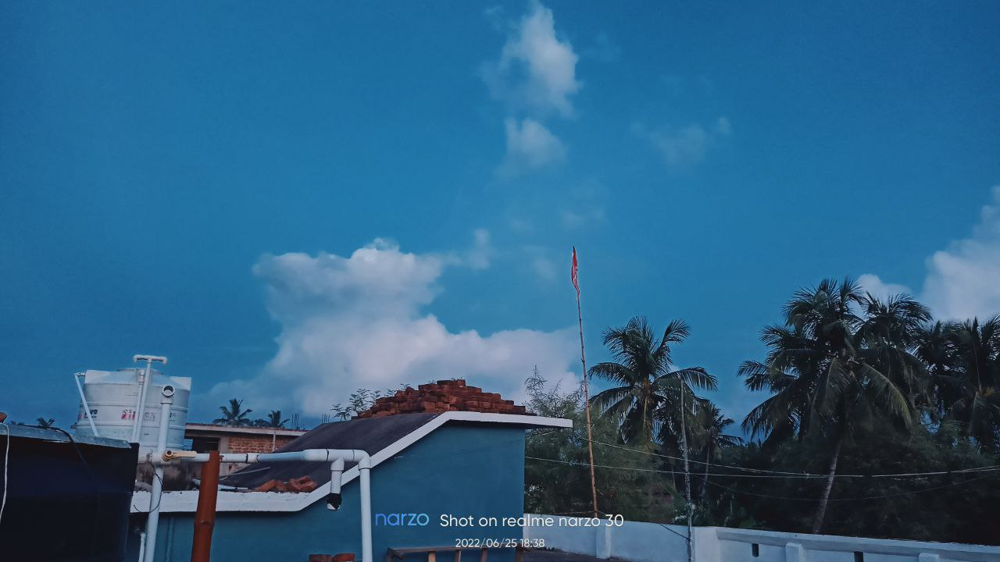
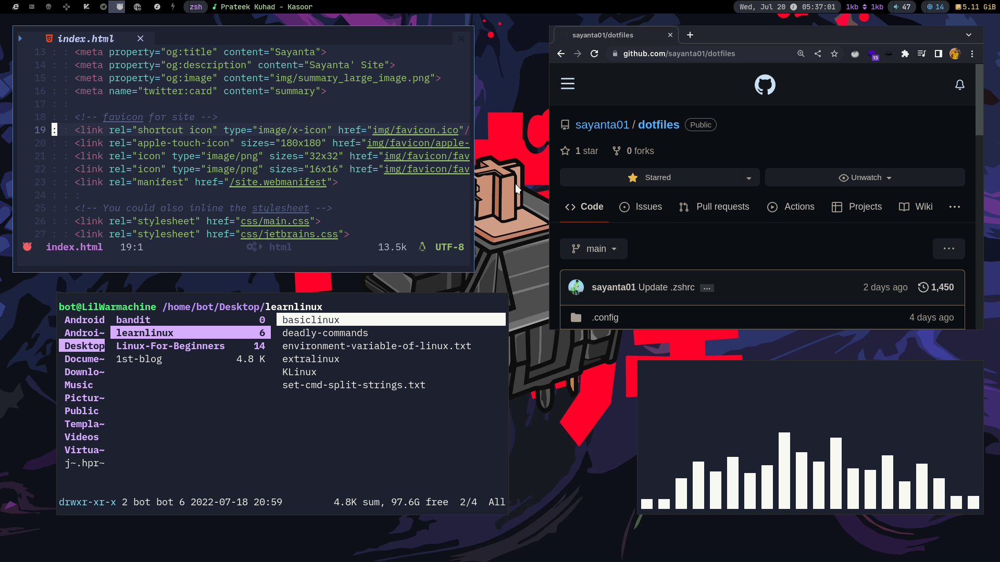
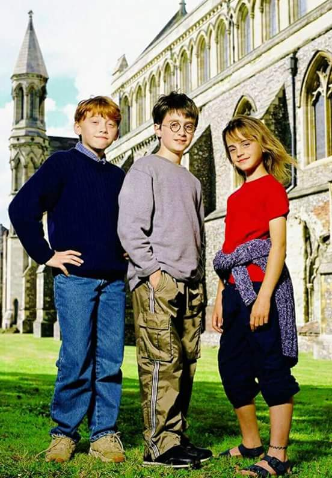
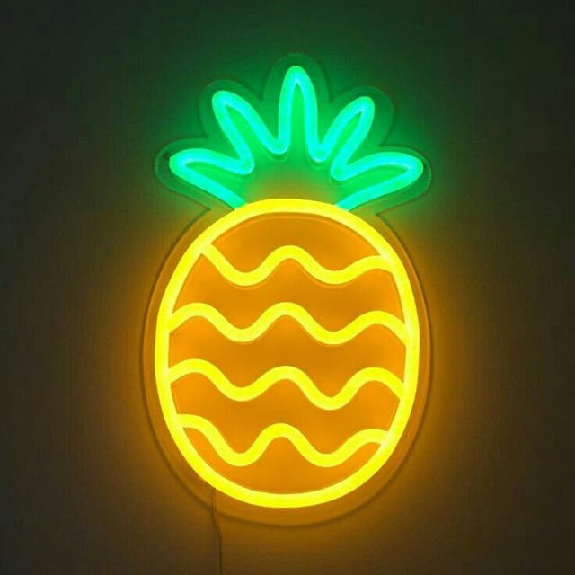
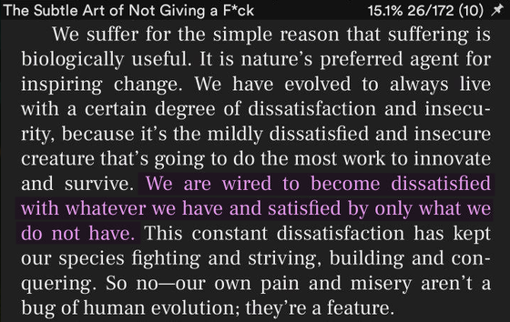
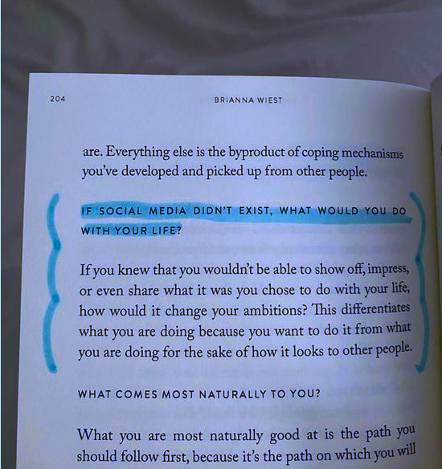
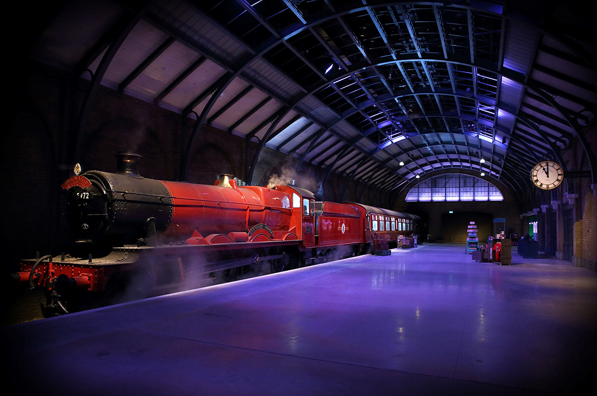
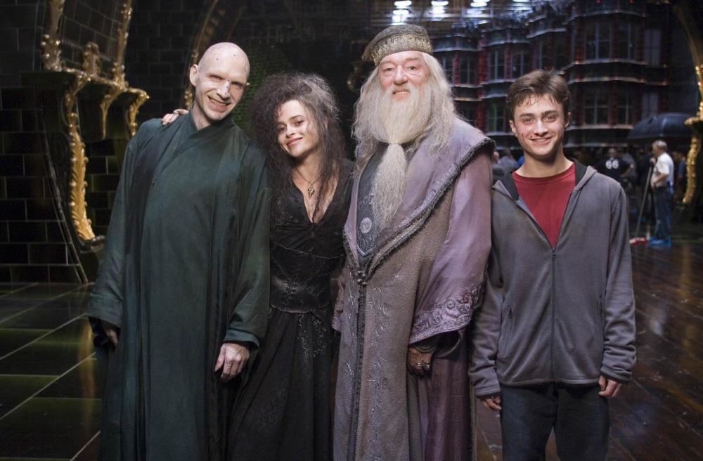

<!DOCTYPE html>
<html lang="en">
  <head>
    <meta charset="utf-8">
    <meta name="viewport" content="width=device-width,initial-scale=1">
    
    <title>Sayanta's Site</title>
    <meta name="description" content="Sayanta's Site">
    
    <!-- Recommended minimum -->
    <meta property="og:title" content="Sayanta">
    <meta property="og:description" content="Sayanta' Site">
    <meta property="og:image" content="img/summary_large_image.png">
    <meta name="twitter:card" content="summary">
    
    <!-- favicon for site -->
    <link rel="shortcut icon" type="image/x-icon" href="img/favicon.ico"/>
    <link rel="apple-touch-icon" sizes="180x180" href="img/favicon/apple-touch-icon.png">
    <link rel="icon" type="image/png" sizes="32x32" href="img/favicon/favicon-32x32.png">
    <link rel="icon" type="image/png" sizes="16x16" href="img/favicon/favicon-16x16.png">
    <link rel="manifest" href="/site.webmanifest">

    <!-- You could also inline the stylesheet -->
    <link rel="stylesheet" href="css/main.css">
    <link rel="stylesheet" href="css/jetbrains.css">

    <!-- special font for special quotes-->
    <link rel="stylesheet" href="https://fonts.googleapis.com/css2?family=Lora&family=Marck+Script&family=Rye&display=swap">

    <!-- Twemoji Font Support -->
    
    
  </head>
  
  <body>
    
    <header>

      <neon>
	
          <a href="#home">NUllxV0iD ></a>​
	
      </neon>

      <edges>
	<nav>
          <a href="#links">Links</a>
          <a href="#blog">Blog</a>
          <a href="#photos">Photos</a>
          <a href="#portfolio">Portfolio</a>
	</nav>
      </edges>
      
    </header>
    
    <main>
      
      <!-- ----------
      ---- Home -----
      -------------->

      <section id="home">
	
	  <blockquote style="opacity: 100">
	  </blockquote>

	  <aside style="border: 1px solid var(--highlight);">
	    <figure>
              
	    </figure>
	  </aside>
	  
          <article>
	    

	      <h2 style="color:var(--highlight)">Hi there!</h2>  
	      <code> I am Sayanta, 18y old guy from india, who loves tinkering with computers and softwares. </code> 
	      
	      <h2 style="color:var(--highlight)" font-family="Twemoji">I Love Linux. 🐧</h2>
	      <code>Arch | Bspwm | Kitty | Neovim </code>
	      
	      <h2 style="color:var(--highlight)"> Likes.. </h2>
	      <code> Computer | Thinks | Privacy |  OpenSource </code>
	    

          </article>

	    <!-- <special-quote> -->
	      <!-- ❝ Life ki lgi pdi h, mere life ki...! ❞  -->
	    <!-- </special-quote> -->
	  </aside>

	  
  

	  <article>
	       
	    

	  </article>

      </section>

      <!-- ----------
      ---- Links ----
      -------------->

      <section id="links">

	<article>
	  <h2>🦉 Personal Links </h2> 
	  

	    <ul>
	      <li>Mail: <a href="mailto:sayantasingh01@gmail.com" target="_blank" rel="noopener noreferrer"> sayantasingh01@gmail.com </a> </li>
	      <!-- <li>IRC: <a href="irc://irc.libera.chat/neovoid" target="_blank" rel="noopener noreferrer">#neovoid@libera.chat</a> </li> -->
	      <!-- <li>MATRIX: <a href="https://matrix.to/#/@void00r:matrix.org" target="_blank" rel="noopener noreferrer">#void00r:matrix.org</a> </li> -->
	      <li>Telegram: <a href="https://telegram.me/noobot01" target="_blank" rel="noopener noreferrer">noobot01</a> </li>
	      <li>Gits: <a href="https://github.com/sayanta01" target="_blank" rel="noopener noreferrer">sayanta01</a></li>
	    </ul>
	  

	</article>
	       
	<article>
	  

	    
 Be the part of <a href="https://gnulinuxindia.org/" target="_blank" rel="noopener">https://gnulinuxindia.org</a>

	    
	  

	</article>
	
      </section>
      

      <!-- ----------
      ---- BLOG -----
      -------------->
      
      <section id="blog">

	<article>
	  <h2> 🌄 My Trip to Mukteshwar </h2>
	  

	    
After spending more than a year in a dark room, I decided to visit mountains first time in my life. I was always excited to do these kind of 

      
stuff. I chose this place Mukteshwar, a small district somewhere in Uttrakhand, India. I did my research and watched many vlogs.
      
I wanted to do all the normie stuff like making vlog and enjoying the views. I had lot of issues regarding my career choices... 
      
	    <a href="blogs/mukteshwar.html">...Read More </a>
	    
	  

	</article>

	<article>
	  <h2> 🏊 And I started Swimming again... </h2>
	  

	    
 After a very long time I have started going to swim at the nearest river dam of my village. 

	    
 I was bored and this is summer which makes things more boring for me. but hey plus thing we have water solution here. 

	    
It was a sunny day, I was bored, trying online CTFs and making website and suddenly I picked this vibe of "sporting"... 

	    <a href="blogs/swimming.html">...Read More </a>
	    
	  

	</article>

	<article>
	  <h2> 💡 Interesting things about this Site. </h2>
	  

	    <ul>
	      <li> You'd be surprised but Yes, Its a Single HTML File.<label for="also">read more</label><input type="checkbox" id="also"><small> 
This website is a single <abbr title="Hypertext Markup Language">HTML</abbr> file. It simply uses the <code>#anchor</code> suffix (from <a href="http://info.cern.ch/hypertext/WWW/Addressing/Addressing.html" target="_blank" rel="noopener noreferer">1992</a>) and the <code>:target</code> <abbr title="Cascading Style Sheets">CSS</abbr> selector to show and hide pages/content.
</small> </li>
	      <li> The site inspired by minimal yet responsive layout of John Does's Site from <a href="https://john-doe.neocities.org" target="_blank" rel="noopener noreferrer">Neocities</a>.<label for="based">expand</label><input type="checkbox" id="based"> <small> 
 This website is databaseless, javascriptless, and builds#$t-free, so you can edit your website with a text editor and upload it somewhere like a normal person.
</small> </li>
	      <li> Every Link on this site opens in new tab. <label for="tabs">but why</label><input type="checkbox" id="tabs"><small>You can always opens links on any site with SHIFT+CLICKS but in this site you dont have to. <textarea readonly rows="2"> <a href="<link>" target="_blank" rel="noopener noreferrer">link</a></textarea> To avoid Security concerns with <code>target="_blank"</code> I strongly recommend that you always add <code>rel="noreferrer noopener"</code> to the anchor element to prevent a type of phishing known as <a href="https://en.wikipedia.org/wiki/Tabnabbing" target="_blank" rel="noopener noreferer">tabnabbing</a>.<label for="tabnab">explain</label><input type="checkbox" id="tabnab"><small><ul> <li> <a href="https://www.jitbit.com/alexblog/256-targetblank---the-most-underestimated-vulnerability-ever/" target="_blank" rel="noopener noreferer"> [1] Alex Yumashev's article on Tabnabbing.</a></li> <li> <a href="https://owasp.org/www-community/attacks/Reverse_Tabnabbing" target="_blank" "rel="noopener noreferer"> [2] Reverse Tabnabbing - OWASP </a></li></ul> </small>
	      </small></li>
	    </ul>

	  

	
	</article>

	<!-- <article> -->
	  <!-- <h2> 🦇 Beautify Linux Manuals with Bat</h2> -->
	<!--   
 -->
	<!--     
 Whatever you are doing, stop right away and do this right now cuz this is <b>IMPORTANT!<b>.   
 -->
	<!--     
 Ever wonder? WHAT IF your favourite RTFM <label for="rtfm">^</label><input type="checkbox" id="rtfm"><small><a href="https://explainxkcd.com/wiki/index.php/293:_RTFM" target="_blank" rel="noopener noreferer">Reading the Fine Manual</a></small> can be experienced with cheering colors of BAT <label for="bat">^</label><input type="checkbox" id="bat"><small> <a href="https://github.com/sharkdp/bat" target="_blank" rel="noopener noreferer"> BAT - A cat(1) clone with syntax highlighting and Git integration.</a></small>. Well Wait no more.
 -->
	<!--     
 Just set this enviromental variable inside your .profile or .zprofile and see the magic of bat. 
 -->
	<!--     
<code style="color:var(--highlight)"> export MANPAGER="sh -c 'col -bx | bat -l man -p'" </code>   
 -->
	<!--     
Thanks me later.
 -->
	<!--   
 -->

	
      </section>

      <!-- ----------
      ---- PHOTOS ---
      ----------- -->

      <section id="photos">

        
My Gallery

        <!-- You can use this grid of images in any page -->

        

          <!--  -->
          <!--  -->
          <!--  -->
          <!--  -->

          
          
          
          
          
          
          
          
          
          
          
          
          
          
          
        

      </section>

      <!-- ----------
      -- PORTFOLIO --
      -------------->

      <section id="portfolio">
        

          <!-- <figure class="cover"> </figure> -->
          <!-- <figure class="cover"></figure> -->
          <figure class="cover"></figure>
          <figure style="background:#533d32">
            
hogwarts is my home.

          </figure>
          <figure class="cover">
            
          </figure>
	  <figure class="cover">
            
            <figcaption>…in mystery and light</figcaption>
          </figure>
          <figure style="background:#37433f">
            
            <figcaption>together</figcaption>
          </figure>
	  <figure>
            
            
forever.

          </figure>
           <figure class="cover">
            
            
Always.

          </figure>
        

      </section>

      <!-- HIDDEN PAGE -->

      <section id="if-you-want">
        
This page is not referenced in the menu, for example.

        
<a href="#home">← back</a>

      </section>

    </main>

    <!-- ----------
     HI-RES IMAGES
    -------------->

    <!-- For the PHOTOS grid -->
    <!--  -->
    <!--  -->
    <!--  -->
    <!--  -->

    
    
    
    
    
    
    
    
    
    
    
    
    
    
    

    
    <!-- Other images -->
    <!--  -->
    
 </body>
</html>
